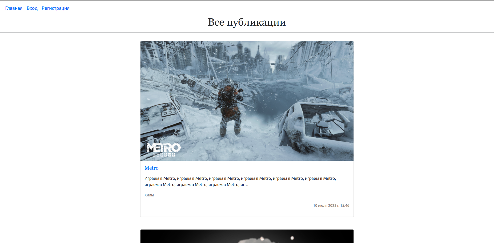

# Fans-MMORPG
Учебный проект Fans-MMORPG, сайт-статейник для любителей компьютерный игр.
Основная цель создания проекта - оттачивания навыков работы с фреймворком
Django.

---
## Описание

При переходе пользователя на сайт, ему будет доступно чтение всех статей.

Чтобы отправить сообщение автору статьи необходимо авторизоваться.

После авторизации пользователю будут доступны следующие возможности:
- создание статей
- изменение и удаление своих статей
- получение и отправка сообщений

Добаление статьи осуществляется с применением полноценного текстового редактора
с возможностью вставки в текст картинок и видео.
Также необходимо добавить обложку статьи.

Во вкладке "Мои статьи" пользователь может просматривать, редактировать и удалять свои
статьи.

Во вкладке "Мои сообщения" пользователь может прочитать сообщения
отправленные другими авторами, нажав кнопку "Принять сообщение".
Отправитель сообщения будет оповещён, письмом отправленным на
электронную почту о прочтении его сообщения.

Полученные сообщения можно сортировать по статьям.

